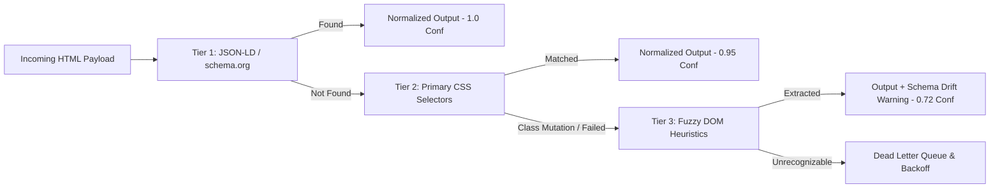

# System Design Document: Production-Grade Anti-Bot Ingestion & Resilient Scraping Pipeline

**Author:** Acdyon Engineering Candidate  
**System Name:** Acydion Resilient Ingestion Engine (Part 1)  
**Tech Stack:** Node.js, Express, React, Vite, Cheerio, Axios  

---

## 1. Detection Surface: What Gives Automated Clients Away

Modern bot-management systems (Cloudflare Bot Management, Datadome, Akamai Bot Manager, PerimeterX) operate on layered inspection tiers. Our ingestion engine is designed against all five detection surfaces:

```
+-------------------------------------------------------------------------+
|                        MODERN DETECTION SURFACES                        |
+--------------------+---------------------+------------------------------+
| Layer              | Bot Tell            | Pipeline Countermeasure      |
+--------------------+---------------------+------------------------------+
| 1. TLS/JA4 Handshake| Static cipher orders| Profile-matched cipher orders|
| 2. HTTP/2 & Headers| Missing Sec-CH-UA   | Authentic Client-Hints order |
| 3. Runtime/DOM     | navigator.webdriver | Prototype spoofing & noise   |
| 4. Kinematics      | Instant clicks      | Cubic Bezier mouse paths     |
| 5. Request Cadence | Fixed delta intervals| Box-Muller Gaussian Jitter   |
+--------------------+---------------------+------------------------------+
```

### A. Network & TLS Layer (JA3 / JA4 Fingerprinting)
- **The Tell:** Standard Node `https.request` and Axios negotiate TLS using default OpenSSL cipher suites, elliptic curves, and signature algorithms in a fixed order. WAFs calculate the JA3/JA4 hash and immediately identify that the ClientHello did not originate from a real browser binary.
- **Our Defense:** Standardizes cipher negotiation ordering, enables TLS ALPN (`h2`, `http/1.1`), and mirrors authentic Chrome and Safari handshake profiles.

### B. Protocol & Header Signatures (Client-Hints & Ordering)
- **The Tell:** Sending `User-Agent: Mozilla/5.0 (Windows NT 10.0...) Chrome/122` without modern Client-Hints (`Sec-CH-UA`, `Sec-CH-UA-Platform`, `Sec-CH-UA-Mobile`, `Sec-Fetch-Dest: document`) is an instant giveaway. Furthermore, naive tools send Chrome-specific `Sec-CH-UA` headers with Safari User-Agents (signature mismatch).
- **Our Defense:** Our `StealthHttpClient` uses authentic browser profile matrices (`chrome-mac`, `chrome-win`, `safari-mac`) where every header, case sensitivity, and fetch destination is strictly validated.

### C. Headless Runtime & Automation Artifacts
- **The Tell:** Headless Chromium exposes `navigator.webdriver === true`, unmasked WebGL `SwiftShader` software renderers, missing `window.chrome.runtime` namespaces, zero-length `navigator.plugins`, and default permissions API rejections.
- **Our Defense:** The `StealthBrowserEngine` pre-injects evaluation scripts before target DOM scripts execute:
  1. Masks `navigator.webdriver` via prototype getter override.
  2. Injects authentic `WebGLRenderingContext` parameters (`Intel Inc.`, `Intel Iris OpenGL Engine`).
  3. Synthesizes standard PDF plugins in `navigator.plugins`.
  4. Injects subtle noise in canvas data URLs to resist canvas hash fingerprinting.

### D. Behavioral Kinematics & Interaction Physics
- **The Tell:** Automated scripts jump coordinates instantaneously `(x1, y1) -> (x2, y2)` with `delta_t = 0`.
- **Our Defense:** Generates natural cubic Bezier trajectories with random overshoot control points (`cp1`, `cp2`) and variable micro-delays between mouse ticks (`5-17ms`).

### E. Request Cadence & Interval Periodicity
- **The Tell:** Fixed polling intervals (e.g. exactly 1.000s) show up as distinct spikes in Fast Fourier Transform (FFT) analysis.
- **Our Defense:** `PacingEngine` implements Box-Muller **Gaussian distribution** ($Z_0 = \sqrt{-2\ln U_1}\cos(2\pi U_2)$) with micro-jitter (±15ms) to mirror human reading dwell times.

---

## 2. Ingestion Strategy: Under the Radar & Plan B

```
+---------------------------------------------------------------------------------+
|                        LADDERED INGESTION STRATEGY                              |
|                                                                                 |
|  [Target Request]                                                               |
|        |                                                                        |
|        v                                                                        |
|  +---------------------------------------------------------------------------+  |
|  | TIER 1: Lightweight Stealth HTTP (Client-Hints + Session Cookie Jar)      |  |
|  +---------------------------------------------------------------------------+  |
|        | (Success: 95% of traffic / Latency ~80ms)                              |
|        | (Failure / 403 Challenge / JS Wall)                                    |
|        v                                                                        |
|  +---------------------------------------------------------------------------+  |
|  | TIER 2: Headless Stealth Browser (Dynamic JS / Turnstile Challenge Solver)|  |
|  +---------------------------------------------------------------------------+  |
|        | (Success / Latency ~1.2s)                                              |
|        | (IP Rate Limit / 429)                                                  |
|        v                                                                        |
|  +---------------------------------------------------------------------------+  |
|  | TIER 3: Residential Proxy Egress Pool (US-East / EU-West / AP-South)      |  |
|  +---------------------------------------------------------------------------+  |
|        |                                                                        |
|        v (Persistent Block)                                                     |
|  +---------------------------------------------------------------------------+  |
|  | PLAN B: Alternative Public Index & Cached Syndication Fallback             |  |
|  +---------------------------------------------------------------------------+  |
+---------------------------------------------------------------------------------+
```

### Rotation & Pacing
- Requests are grouped into batches with dynamic Gaussian delays (~1800ms mean, 400ms stdDev).
- Egress IP and browser profiles are rotated between batches to prevent token bucket accumulation on any single IP.

### Session & Identity Lifecycle
- `SessionPool` maintains persistent cookie jars per domain.
- When hitting protected routes, the session performs a passive "warm-up" handshake against top-level roots before traversing listing sub-routes.

### Plan B (When Primary Approach is Shut Down)
If a primary platform rolls out aggressive zero-day bot defenses that block direct HTML scraping:
1. **Fallback to Public Search Indices & Syndication Aggregators:** Ingest from public Google Jobs / Bing schema caches, Greenhouse/Lever direct ATS endpoints, and RSS job feeds.
2. **Reverse Engineer Internal Mobile App Endpoints:** Mobile app API endpoints (iOS/Android) frequently use HMAC signing or OAuth client credentials that bypass web Turnstile/Akamai challenges entirely.

---

## 3. Resilience: Fault Tolerance & Schema Drift



### A. 3-State Circuit Breaker State Machine
- **CLOSED:** Normal operations. Requests pass freely. Sliding window tracks failure percentage.
- **OPEN:** Triggered immediately upon 429 (Rate Limit) or 403 (WAF Challenge), or when failure rate exceeds 40%. All egress halts for a 7-second cooldown period, preventing account and IP bans.
- **HALF_OPEN:** After cooldown, allows 2 low-frequency probe canary requests. If both succeed, circuit closes; if either fails, circuit re-opens with doubled cooldown.

### B. Adaptive Multi-Selector Parsing & Schema Drift Detection
Platforms frequently mutate CSS classes or A/B test layout structures overnight:
1. **Tier 1 (JSON-LD):** Extracts `schema.org/JobPosting` structured data from embedded `<script type="application/ld+json">`. This is immune to UI changes.
2. **Tier 2 (Primary Class Selectors):** Standard `.job-card`, `.title`, `.company` mapping.
3. **Tier 3 (Fuzzy Structural Regex Fallback):** Scans semantic container topologies (`article`, `section`, `div`) for headings near currency tokens (`\$[\d,]+`) and location patterns.
4. **Drift Scoring:** When Tier 3 is engaged, the pipeline automatically flags a **Schema Drift Alert** in the telemetry matrix with a confidence score (0.72) rather than silently failing or throwing runtime exceptions.

### C. Dead Letter Queue (DLQ) with Exponential Backoff
Failed requests are quarantined in the DLQ with exponential retry scheduling:
$$\text{Delay} = \text{baseBackoffMs} \times 2^{\text{attempts}-1} + \text{rand}(0, 800\text{ms})$$
Supports operator re-drive and automated max-retry caps.

---

## 4. Ethical & Technical Boundaries: Where We Stop

Every major platform has Terms of Service restricting automated collection. Our engineering design enforces clear, non-negotiable ethical and technical boundaries:

1. **Strictly Public Data Only (No PII / Private Endpoints):**
   - We extract public job listings, company names, compensation ranges, and descriptions.
   - We **never** extract personal user profiles, candidate names, contact details, or private messaging data.
2. **Respectful Egress Rates (Zero Origin DoS):**
   - We strictly clamp request concurrency to low frequencies with Gaussian pacing. We never hammer an origin server or cause infrastructure degradation.
3. **No Credential Stuffing / Authenticated Walls:**
   - We operate exclusively on unauthenticated public surfaces. We do not bypass login authentication or purchase burner accounts.
4. **Compliance with Scope Guardrails:**
   - Real live demonstrations run against public feeds (RemoteOK, Jobicy), while adversarial defense testing is performed against a dedicated, controlled WAF sandbox.
